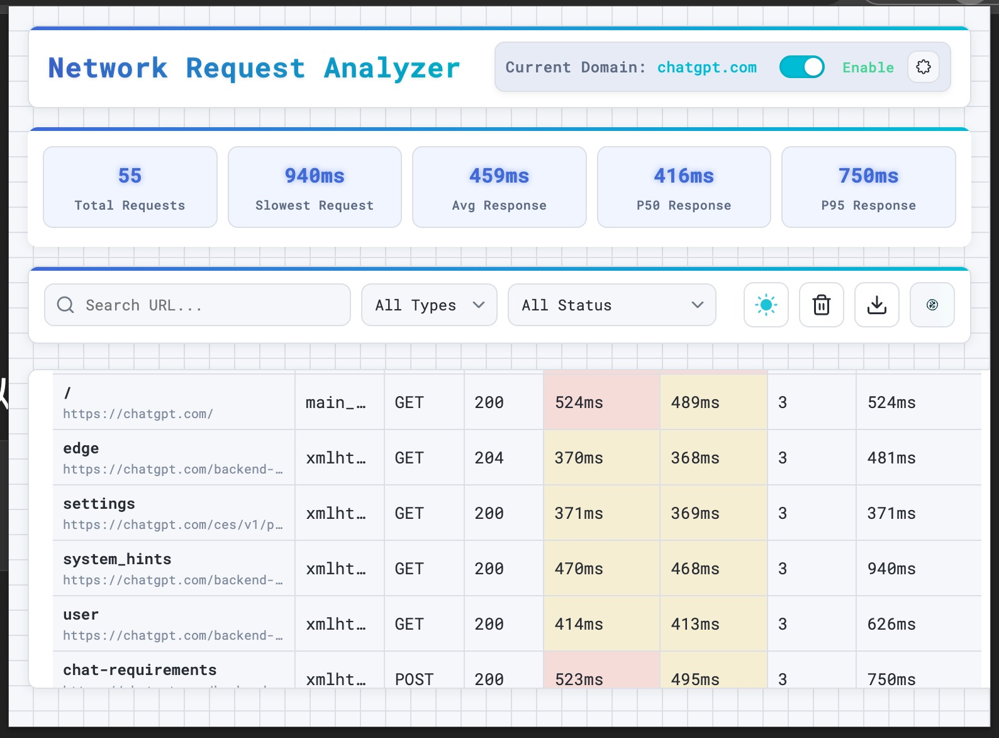
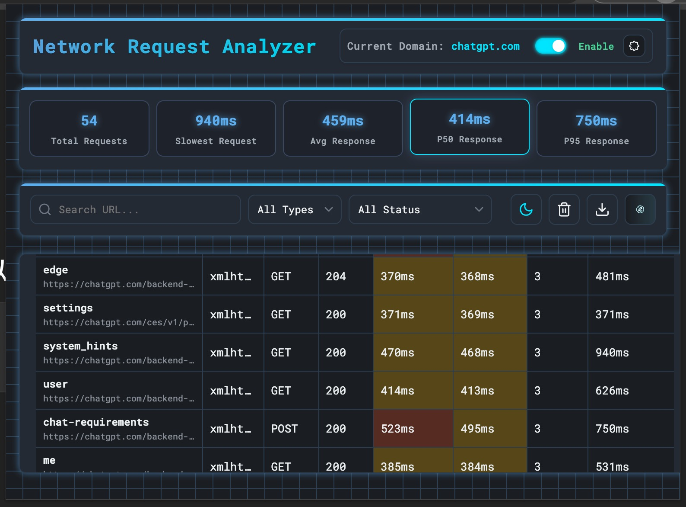
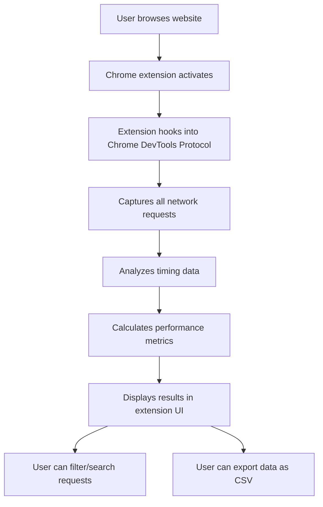

# Network Request Analyzer Chrome Extension

This Chrome extension analyzes the timing of all network requests on the current page. It provides detailed information about each request, including:

- URL
- Request type (document, stylesheet, script, image, etc.)
- HTTP method (GET, POST, etc.)
- Status code
- Total request time
- Time to First Byte (TTFB)
- Performance metrics (P99, P95, P90, P50, Average)
- And more...

## Screenshots

The extension supports both light and dark themes:

### Light Mode

### Dark Mode

## How It Works

Below is a simplified workflow of how the extension captures and analyzes network requests:

## Installation

1. Download or clone this repository
2. Open Chrome and navigate to `chrome://extensions/`
3. Enable "Developer mode" by toggling the switch in the top right corner
4. Click "Load unpacked" and select the directory containing this extension
5. The extension should now be installed and visible in your Chrome toolbar

## Usage

1. Browse to any website
2. Click the Network Request Analyzer icon in your Chrome toolbar
3. View the timing information for all network requests made by the page
4. Use the search and filter options to find specific requests
5. View performance metrics like P99, P95, P90, P50, and average response times
6. Click on any request to view detailed information
7. Use the "Export CSV" button to download the data for further analysis

## Features

- Real-time monitoring of all network requests
- Performance metrics dashboard showing P99, P95, P90, P50, and average response times
- Filtering by request type and status
- Search functionality to find specific URLs
- Color-coding based on request duration (fast, medium, slow)
- Detailed view of individual requests
- CSV export for data analysis (includes performance metrics)

## Performance Metrics

The extension calculates the following performance metrics:

- **P99**: The 99th percentile response time - 99% of requests complete within this time
- **P95**: The 95th percentile response time
- **P90**: The 90th percentile response time
- **P50**: The median response time (50th percentile)
- **Average**: The average response time of all requests

These metrics are calculated based on the currently filtered requests, allowing you to analyze performance for specific request types or status codes.

## License

MIT