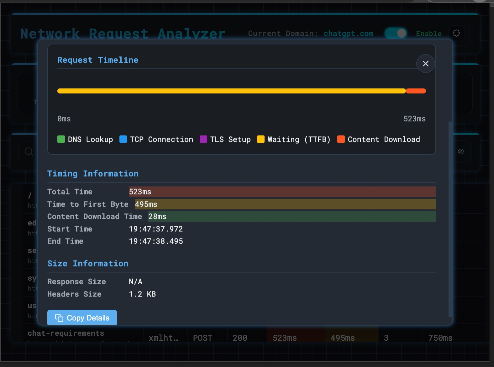

# Network Request Analyzer

<div align="center">
  
</div>

🚀 A powerful Chrome extension for analyzing network requests with AI-powered insights!

[](https://chromewebstore.google.com/detail/network-request-analyzer/nbhkalnbmfkedmigpehagkcoocogegcp)
[](https://chromewebstore.google.com/detail/network-request-analyzer/nbhkalnbmfkedmigpehagkcoocogegcp)
[](https://chromewebstore.google.com/detail/network-request-analyzer/nbhkalnbmfkedmigpehagkcoocogegcp)

## 🌟 Features

### Network Request Analysis
- Real-time monitoring of all HTTP/HTTPS requests
- Detailed timing breakdown (DNS, TCP, TLS, TTFB, etc.)
- Request/response headers and payload inspection
- Error tracking and analysis
- Performance metrics and statistics

<div align="center">
  
  <p><em>Network Analysis Interface - Light Theme</em></p>
</div>

### AI-Powered Insights
- Intelligent performance bottleneck detection
- Security risk assessment
- Optimization recommendations
- Pattern recognition and analysis
- Multiple AI provider support (OpenAI, Anthropic, Deepseek)

<div align="center">
  
  <p><em>AI-Powered Analysis Interface</em></p>
</div>

### Advanced Features
- Domain-based filtering
- Custom analysis rules
- Data export capabilities
- Theme customization
- Multi-language support

<div align="center">
  
  <p><em>Detailed Request Analysis View</em></p>
</div>

## 🎨 Themes

<div align="center">
  <table>
    <tr>
      <td align="center">
        
        <p><em>Dark Theme</em></p>
      </td>
      <td align="center">
        
        <p><em>Fire Dark Theme</em></p>
      </td>
    </tr>
  </table>
</div>

## ⚙️ Configuration

Easily customize your experience with our intuitive settings interface:

<div align="center">
  <table>
    <tr>
      <td align="center">
        
        <p><em>General Settings</em></p>
      </td>
      <td align="center">
        
        <p><em>AI Provider Configuration</em></p>
      </td>
    </tr>
  </table>
</div>

## 🚀 Installation

### Chrome Web Store
Install directly from the [Chrome Web Store](https://chromewebstore.google.com/detail/network-request-analyzer/nbhkalnbmfkedmigpehagkcoocogegcp)

### Developer Mode
1. Clone this repository
2. Open Chrome Extensions page (chrome://extensions/)
3. Enable "Developer mode"
4. Click "Load unpacked"
5. Select the project directory

## 🔧 Configuration

### AI Provider Setup
1. Open extension options
2. Select your preferred AI provider
3. Enter your API key
4. Configure additional provider settings

### Display Settings
- Theme selection (Light/Dark)
- Table column customization
- Statistics display options
- Language preferences

## 💻 Development

### Prerequisites
- Node.js 14+
- Chrome Browser

### Setup
```bash
# Install dependencies
npm install

# Build project
./build.sh
```

### Project Structure
See [project-structure.md](project-structure.md) for detailed project structure documentation.

## 🤝 Contributing

1. Fork the repository
2. Create your feature branch
3. Commit your changes
4. Push to the branch
5. Create a Pull Request

## 📝 Documentation

### User Documentation
- [Getting Started Guide](docs/user-guide.md#getting-started)
- [Basic Usage](docs/user-guide.md#basic-usage)
- [Advanced Features](docs/user-guide.md#advanced-features)
- [Configuration Guide](docs/user-guide.md#configuration)
- [Troubleshooting](docs/user-guide.md#troubleshooting)

### Developer Documentation
- [API Reference](docs/api.md)
- [Development Setup](docs/development.md#development-setup)
- [Project Structure](project-structure.md)
- [Contributing Guidelines](docs/development.md#contributing)
- [Testing Guidelines](docs/development.md#testing-guidelines)

### Additional Resources
- [Performance Optimization](docs/development.md#performance-optimization)
- [Security Guidelines](docs/development.md#security-guidelines)
- [Release Process](docs/development.md#deployment)
- [Roadmap](roadmap.md)

## 🔒 Privacy

This extension:
- Does not collect or use your data for unauthorized purposes
- Does not sell data to third parties
- Does not transfer data for purposes unrelated to core functionality
- Does not use data for credit determination or lending purposes

## 📫 Support

- GitHub Issues: Bug reports and feature requests
- Email: weetime001@gmail.com
- [Troubleshooting Guide](docs/user-guide.md#troubleshooting)
- [FAQ](docs/user-guide.md#faq)

## 📄 License

MIT License - See [LICENSE](LICENSE) file

## 🙏 Acknowledgments

- Chrome Extension API
- AI Service Providers
- Open Source Community